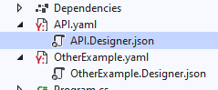

# PosInformatique.MSBuild.Yaml
PosInformatique.MSBuild.Yaml is a MSBuild extension that converts YAML files into a JSON during the compilation of a Visual Studio project (C#, VB. NET, ...).

This extension is very useful when you want to use YAML format for user friendly
specifications, but you need to provides a JSON format into your assemblies.

For example you can use this extension for the following scenario:
- You can specify a Web API specification using
[Swagger](https://swagger.io/)/[Open API](https://www.openapis.org/) specifications
with a YAML file and you can integrate the JSON file generated into assembly
which can be reused an exposed by [Swashbuckle(https://github.com/domaindrivendev/Swashbuckle.AspNetCore)

## Setting up

[PosInformatique.MSBuild.Yaml](https://github.com/PosInformatique/PosInformatique.MSBuild.Yaml)
provides an MSBuild task called `YamlToJson`. This task can be used with two ways:
- Call the `YamlToJson` MSBuild task explicitly.
- Declare YAML file to convert automatically before each compilation.

The [PosInformatique.MSBuild.Yaml](https://www.nuget.org/packages/PosInformatique.MSBuild.Yaml/)
is available directly on the [NuGet](https://www.nuget.org/) official website.

### Call the `YamlToJson` MSBuild task explicitly.

To use the `YamlToJson` MSBuild task:

- Install the [PosInformatique.MSBuild.Yaml](https://www.nuget.org/packages/PosInformatique.MSBuild.Yaml/)
package using the following command line in the Visual Studio Package Manager console:
```powershell
Install-Package PosInformatique.AspNetCore.Server.AspNet
```

- Calls the `YamlToJson` tasks in your `.xxproj` file using MSBuild syntax:
````xml 
<Project>
  <Target Name="ConvertToJson">
    <YamlToJson YamlInputFile="Api.yaml" JsonOutputFile="Api.json" />
  </Target>
</Project>
````
The previous example will converts the YAML content of the `Api.yaml` file into
JSON format to the `Api.json` file.

### Declare YAML file to convert automatically before each compilation.

This method allow to generate automatically YAML files before compilation
of a `.xxproj` file. The input YAML files declared are automatically generated
into a `.Designer.json` file.



To declare YAML files to generate automatically before compilation:

- Install the [PosInformatique.MSBuild.Yaml](https://www.nuget.org/packages/PosInformatique.MSBuild.Yaml/)
package using the following command line in the Visual Studio Package Manager console:
```powershell
Install-Package PosInformatique.AspNetCore.Server.AspNet
```

- Updates the `.xxproj` file by declaring the YAML files in the `<YamlToJsonFile>`
inside an `<ItemGroup>` element.

```xml
<Project>
  <ItemGroup>
    <YamlToJsonFile Include="API.yaml" WithIndentation="false" />
  </ItemGroup>
</Project>
```

In the previous example, the `API.yaml` file will be convert into
`API.Designer.json` JSON file with indentation disabled.

The `WithIndentation` attribute allow to indent or not the output JSON file. If
this option is not specified, the indentation is enabled (it is mean by default
the option `WithIndentation` is defined to `true`).

**REMARKS**: It is possible to changes the behavior of the `.Designer.json` file
to be embedded as resource or copy the file into the output folder of the project.
Defines the behavior as usual using the `Properties` window inside Visual Studio
or by customized manually the `.xxproj`.

For example to include the JSON file generated as embedded resources of the assembly
compiled, use the following code:
```xml 
<ItemGroup>
  <EmbeddedResource Include="API.Designer.json" />
</ItemGroup>
```

## YamlToJson MSBuild task documentation

The full documentation of the MSBuild task documentation is specified
in the [YamlToJson task](./Documentation/YamlToJsonTaskDocumentation.md) page.

## Contributions
Do not hesitate to clone my code and submit some changes...
It is a open source project, so everyone is welcome to improve this library...

By the way, I am french...
So maybe you will remarks that my english is not really fluent...
So do not hesitate to fix my resources strings or my documentation... Merci !

## Thanks
I want to thank the [DiliTrust](https://www.dilitrust.com/) company to test
and gave me their feedback of this library for their
Swagger Web API and Kubernetes usage.